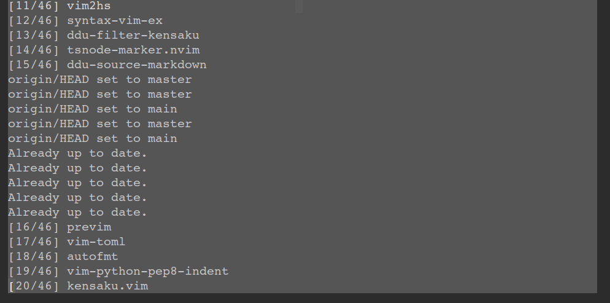

# dpp-ext-installer

This ext implements plugins installer.

## Required

### denops.vim

https://github.com/vim-denops/denops.vim

### dpp.vim

https://github.com/Shougo/dpp.vim

## Configuration

```vim
	" Install plugins
	call dpp#async_ext_action('installer', 'install')

	" Update plugins
	call dpp#async_ext_action('installer', 'update')

	" Update plugins with specify rollback revisions
	call dpp#async_ext_action('installer', 'update',
	\ #{ rollback: 'latest' })

	" Update dpp.vim
	call dpp#async_ext_action('installer', 'update',
	\ #{ names: ['dpp.vim'] })

	" Check not updated plugins
	call dpp#async_ext_action('installer', 'checkNotUpdated')

	" Get not installed plugins
	echo dpp#sync_ext_action('installer', 'getNotInstalled')
```

## Screenshots


