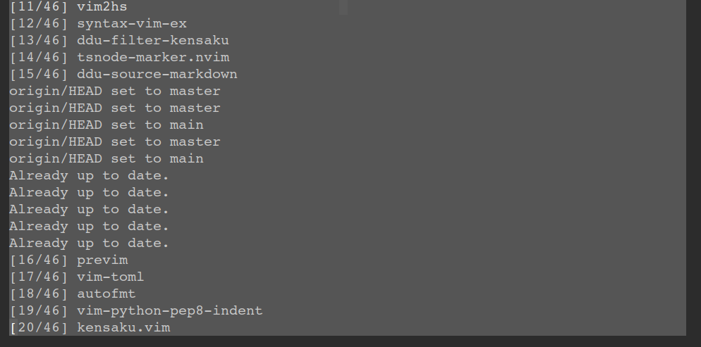

# dpp-ext-installer

This ext implements plugins installer.

## Required

### denops.vim

https://github.com/vim-denops/denops.vim

### dpp.vim

https://github.com/Shougo/dpp.vim

## Configuration

```vim
	" Install plugins
	call dpp#async_ext_action('installer', 'install')

	" Update plugins
	call dpp#async_ext_action('installer', 'update')

	" Update plugins with specify rollback revisions
	call dpp#async_ext_action('installer', 'update',
	\ #{ rollback: 'latest' })

	" Update dpp.vim
	call dpp#async_ext_action('installer', 'update',
	\ #{ names: ['dpp.vim'] })

	" Check not updated plugins
	call dpp#async_ext_action('installer', 'checkNotUpdated')

	" Check not updated plugins (protocol-based)
	call dpp#async_ext_action('installer', 'checkUpdated')

	" Get not installed plugins
	echo dpp#sync_ext_action('installer', 'getNotInstalled')
```

## Rollback

`dpp-ext-installer` automatically saves the current plugin revisions before
every `install`, `reinstall`, or `update` operation. Each snapshot is stored as
a `rollback.json` file under:

```
{base-path}/{name}/rollbacks/{YYMMDDhhmmss}/rollback.json
```

The special name `latest` always points to the most recent snapshot. If a plugin
update introduces a regression you can restore the previous state immediately
with:

```vim
" Restore plugins to the state they were in before the last update
call dpp#async_ext_action('installer', 'update',
\ #{ rollback: 'latest' })
```

You can also roll back to a specific date/time by supplying a `YYMMDDhhmmss`
string instead of `'latest'`.

Rollback is intended for quickly recovering from a plugin update that caused
problems in your local environment.

## Screenshots


